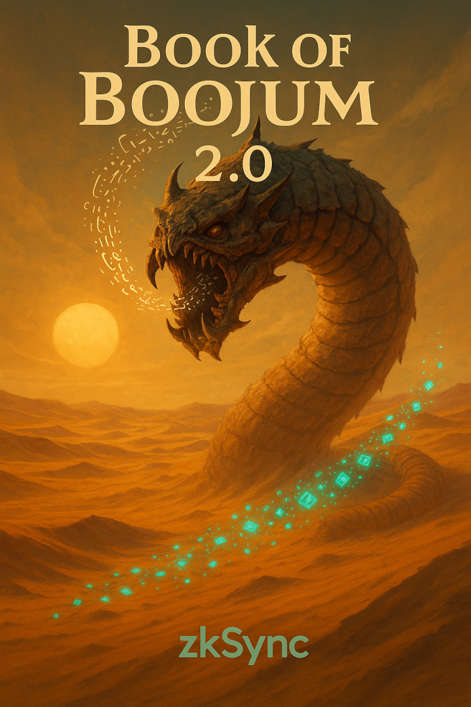

# The book of Boojum 2.0

How Boojum 2.0 turns programs into proofs.

These docs are split into 3 parts:

* [Basics](./basics/) - that cover basic concepts of math, proofs etc.
* [Advanced](./advanced/) - covering more complex topics, adding some impmementation details and caveats

* [Code Walkthough](./code_walkthrough/) - that looks at the code snippets of the actual boojum code.
